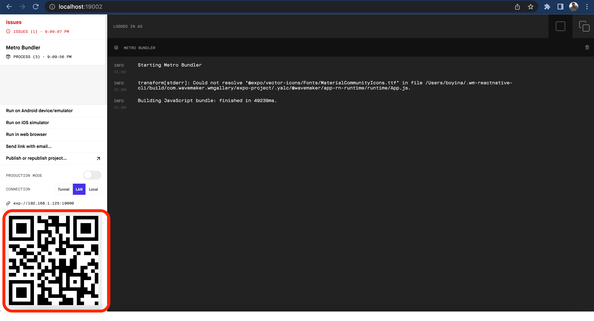
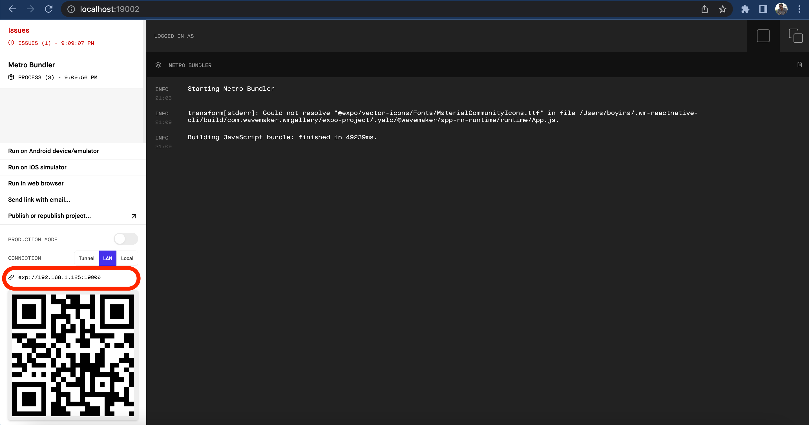
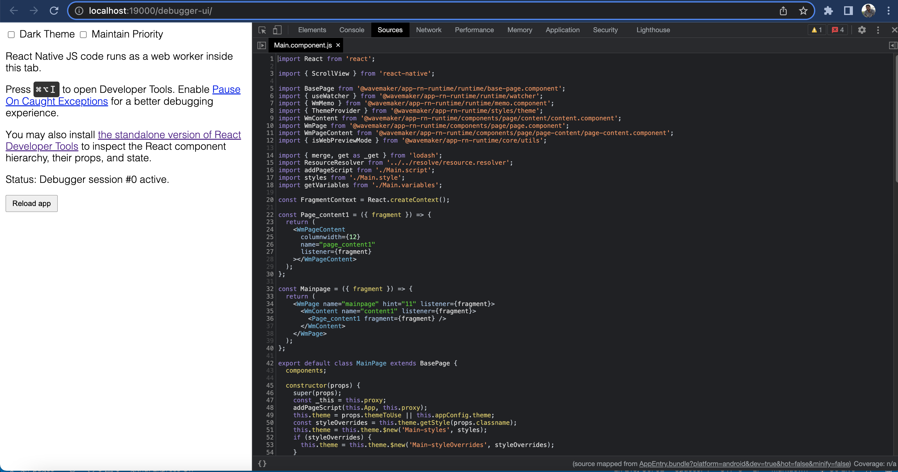
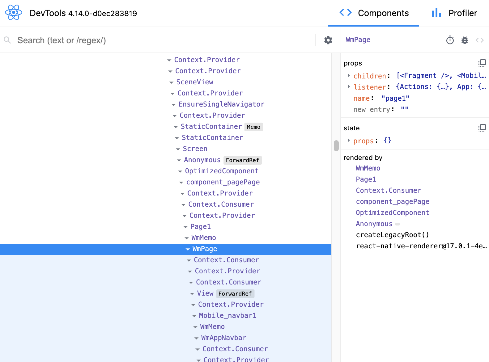

Mobile app developers can preview their apps using Preview button. To see the complete app along with their native capabilities, developers have to build the installer (apk or ipa) for respective OS. This build step consumes 10 mins of developer time. To improve your productivity, we will be use Expo Go app to see an instant preview of the app without building the installer

**Pre-requisites:**

1. Make sure you have node 12 and npm 7 installed in your machine
2. Install wm-reactnative-cli in your machine using below command
 ```npm install -g https://github.com/wavemaker/wm-reactnative-cli```
3. Install Expo Go app on your mobile phone from [Playstore](https://play.google.com/store/apps/details?id=host.exp.exponent) or [App Store](https://apps.apple.com/us/app/expo-go/id982107779)
4. Install React Dev Tools `npm i -g react-devtools@4.14.0`.

**Debugging Procedure:**

1. In your React Native application, create a java service with name as ProjectService
2. Except the package statement at the top, replace the java service content with below code.

```
import javax.servlet.http.HttpServletRequest;
import javax.servlet.http.HttpServletResponse;

import org.apache.commons.io.FileUtils;
import org.slf4j.Logger;
import org.slf4j.LoggerFactory;

import org.springframework.beans.factory.annotation.Autowired;


import com.wavemaker.runtime.security.SecurityService;
import com.wavemaker.runtime.service.annotations.ExposeToClient;
import com.wavemaker.runtime.service.annotations.HideFromClient;

import java.io.File;
import java.io.FileInputStream;
import java.io.FileOutputStream;
import java.io.IOException;
import java.nio.file.FileSystems;
import java.nio.file.Path;
import java.nio.file.Paths;
import java.util.Arrays;
import java.util.Scanner;
import java.util.regex.Matcher;
import java.util.regex.Pattern;
import java.util.zip.ZipEntry;
import java.util.zip.ZipOutputStream;

/**
 * This is a singleton class with all its public methods exposed as REST APIs via generated controller class.
 * To avoid exposing an API for a particular public method, annotate it with @HideFromClient.
 *
 * Method names will play a major role in defining the Http Method for the generated APIs. For example, a method name
 * that starts with delete/remove, will make the API exposed as Http Method "DELETE".
 *
 * Method Parameters of type primitives (including java.lang.String) will be exposed as Query Parameters &
 * Complex Types/Objects will become part of the Request body in the generated API.
 *
 * NOTE: We do not recommend using method overloading on client exposed methods.
 */
@ExposeToClient
public class ProjectService {

    private static final Logger logger = LoggerFactory.getLogger(ProjectService.class);

    private String[] filesToExclude = {
            "WEB-INF/.*",
            //"resources/.*",
            "rn-bundle/.*",
    };
    private String[] filesToInclude = {
            "index.html",
            "WEB-INF/prefabs/.*"
    };


    @Autowired
    private SecurityService securityService;

    private Pattern buildPattern(String prefix, String[] reg) {
        String pattern = Arrays.stream(reg)
                .map(s -> "(" + prefix + s + ")")
                .reduce((a, s) -> a + "|" +  s)
                .get();
        return Pattern.compile(pattern);
    }

    private ZipFile.FileSelector getFileSelector(String prefix, long after) {
        Pattern patternToExclude = buildPattern(prefix + "/", filesToExclude);
        Pattern patternToInclude = buildPattern(prefix + "/", filesToInclude);
        return (entryPath) -> {
            File entry = new File(entryPath);
            return entry.isDirectory()
                    || entryPath.endsWith("wm_rn_config.json")
                    || ((patternToInclude.matcher(entryPath).matches()
                    || !patternToExclude.matcher(entryPath).matches())
                    && (after <= 0 || entry.lastModified() > after));
        };
    }

    public String exportChanges(HttpServletRequest request, HttpServletResponse response) throws Exception {
        Scanner s = null;
        String afterStr = request.getParameter("after");
        long after = afterStr == null ? 0 : Long.parseLong(afterStr);
        boolean all = after == 0;
        File changeFile = null;
        response.setHeader("X-WM-EXPORTED-AT", System.currentTimeMillis() + "");
        try {
            String path = ProjectService.class.getProtectionDomain().getCodeSource().getLocation().getPath();
            int srcIndex = path.lastIndexOf("/src");
            if (srcIndex > 0) {
                String projectPath = path.substring(0, path.lastIndexOf("/src"));
                String webappPath = projectPath + "/src/main/webapp";
                changeFile = File.createTempFile("change-", ".zip");
                changeFile.deleteOnExit();
                ZipFile zipFile = new ZipFile(new File(webappPath), changeFile, this.getFileSelector(webappPath, after));
                zipFile.create();
                if (zipFile.getNumOfEntries() > 1) {
                    response.setContentType("application/octet-stream");
                    response.setHeader("Content-Disposition", "filename=\"" + changeFile.getName() + "\"");
                    org.apache.commons.io.FileUtils.copyFile(changeFile, response.getOutputStream());
                } else {
                    response.setStatus(304);
                }
            }
            return null;
        } finally {
            if (s != null) {
                s.close();
            }
            if (changeFile != null) {
                FileUtils.deleteQuietly(changeFile);
            }

        }
    }

}

class ZipFile {
    public static interface FileSelector {
        public boolean canAdd(String path);
    }
    private static final Logger logger = LoggerFactory.getLogger(ZipFile.class);

    private final File srcFolder;
    private final File destZipFile;
    private final FileSelector fileSelector;
    private int noOfEntries = 0;

    public ZipFile(File srcFolder, File destZipFile, FileSelector fileSelector) {
        this.srcFolder = srcFolder;
        this.destZipFile = destZipFile;
        this.fileSelector = fileSelector;
    }

    public boolean isEmpty() {
        return this.noOfEntries == 0;
    }

    public int getNumOfEntries() {
        return this.noOfEntries;
    }

    public void create() throws IOException {
        Path rootPath = Paths.get(srcFolder.getAbsolutePath());
        try (FileOutputStream fileWriter = new FileOutputStream(destZipFile);
            ZipOutputStream zip = new ZipOutputStream(fileWriter)) {
            this.addFolderToZip(rootPath, srcFolder, zip);
        }
    }

    private void addFileToZip(Path rootPath, File srcFile, ZipOutputStream zip) throws IOException {
        if (fileSelector != null && !fileSelector.canAdd(srcFile.getAbsolutePath())) {
            return;
        }
        if (srcFile.isDirectory()) {
            this.addFolderToZip(rootPath, srcFile, zip);
        } else {
            this.noOfEntries++;
            byte[] buf = new byte[1024];
            int len;
            try (FileInputStream in = new FileInputStream(srcFile)) {
                String name = srcFile.getPath();
                name = rootPath.relativize(Paths.get(name)).toString();
                zip.putNextEntry(new ZipEntry(name));
                while ((len = in.read(buf)) > 0) {
                    zip.write(buf, 0, len);
                }
            }
        }
    }

    private void addFolderToZip(Path rootPath, File srcFolder, ZipOutputStream zip) throws IOException {
        for (File fileName : srcFolder.listFiles()) {
            this.addFileToZip(rootPath, fileName, zip);
        }
    }
}

```
3. If your react native application is configured with security then make sure that ProjectService permission is set to Everyone. For more information on how to configure permissions, [see this](https://docs.wavemaker.com/learn/app-development/app-security/access-levels-permissions)
4. Now preview the application and copy the preview url. Ex: ```https://wm11.wavemakeronline.com/…../{Project_Name}```
5. Execute the following command in your machine terminal
   ```wm-reactnative run expo ${APP_PREVIEW_URL}```
6. Once command gets executed successfully, open [http://localhost:19002/](http://localhost:19002/) in your chrome browser
7. If  you have Android, open the Expo Go app and scan the QR code that appears at the left bottom of [http://localhost:19002/](http://localhost:19002/)  

8. If you have iOS, open the safari browser in your iPhone and type the exp url that appears on top of the QR code. Expo Go will open automatically.

9. When you shake the phone, the expo developer menu opens up. In the developer menu, click on `Debug Remote JS` option to debug the JavaScript of the app.
</img>
10. Open [http://localhost:19000/debugger-ui/](http://localhost:19000/debugger-ui/) in your system. If there are many tabs with the same url, close all except any one.


11. To view React Native component tree, execute `react-devtools` in terminal. Then reload the app in mobile from the developer menu.


## Additional Resources
1. [https://docs.expo.dev/workflow/debugging/](https://docs.expo.dev/workflow/debugging/)