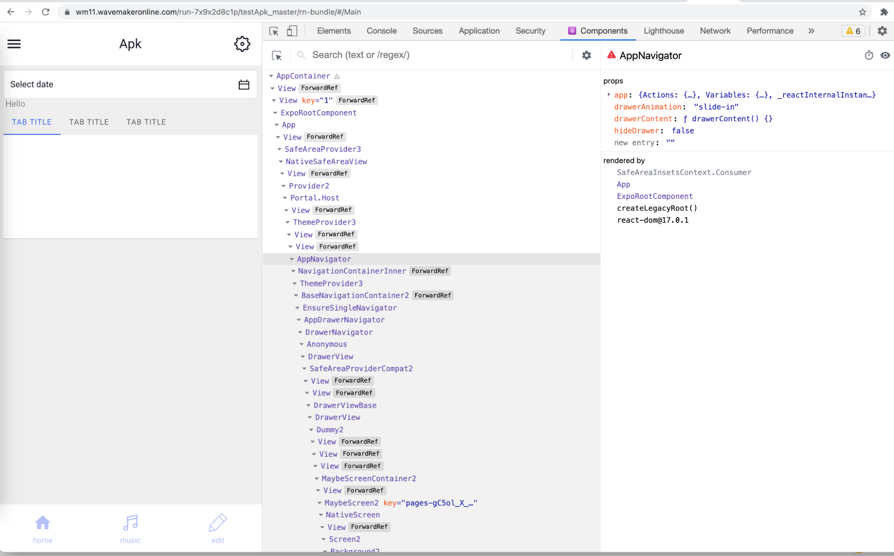
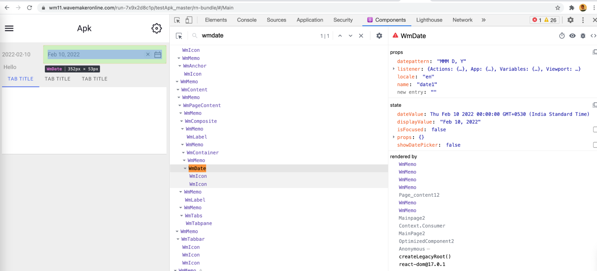

# {{ page.title }}

## Prerequisites
- Install [React Developer tools](https://chrome.google.com/webstore/detail/react-developer-tools/fmkadmapgofadopljbjfkapdkoienihi) from chrome web store. 

## Debugging Procedure:
1. Open the app preview url in chrome.
2. Page scripts can be easily viewed and debugged. To open, press ctrl+p or cmd+p and then enter the page name.
3. Components tab of the React developer tools will appear in chrome debug tools. In this tab, one can see the React Component tree. Avoiding using elements tree in the chrome debug tools.

4. Select the component to see its props, state and style details. 
5. Using regular expressions, components in the tree can be hidden or shown. 
    - Click on the setting icon that is next to search bar.
    - Select components tab in the popup.
    - Click on add filter button.
    - Mention the regular expression. **^(?!Wm)** can be used to view only WaveMaker components.
    

6. In style details, there is a _trace object. _trace object contains sources that participated in the preparation of the final style.  In the trace object, styles of later sources are overridden by the former sources.